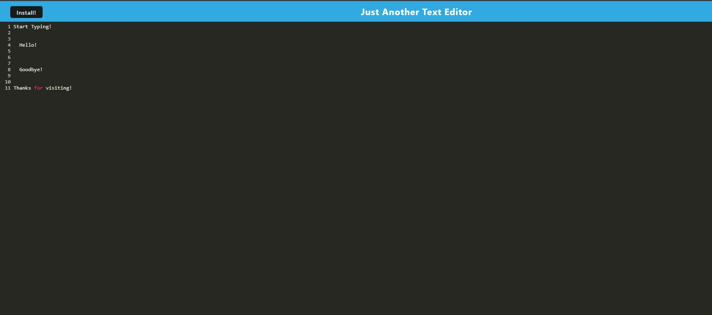

# Week 19 - PWA Final Challenge (WORK IN PROGRESS!)

  A text editor that utilized PWA technology to work on or offline, and can be downloaded as well.  
  

  ## Description

  This text editor allows the user to write lines of code online. There are multiple redundancies to fall back on in case the user goes offline at any point, saving their work and reloading it. 

  Screenshot of final output:  
  

  ## Table of Contents
  * [Dependencies](#dependencies)
  * [Installation](#installation)
  * [Executing Program](#execution)
  * [Authors](#authors)
  * [Questions](#questions)
  * [License](#license)
  * [Acknowledgements](#acknowledgements)
  * [Tests](#tests)

  Link to the repository:  
  https://github.com/dionkb/vigilant-octo-disco.git

  ## Getting Started

  ### Dependencies
  See package.json file within repository

  ### Installation
  N/A

  ## Usage

  ### Executing Program
  Follow the link below to the deployed application, and begin typing!
  
  Link to the deployed application:  
  ADDDDD MEEE!

  ## Additional Information

  ### Authors
  Dion Baskara

  ### Questions
  For any questions, please reach out to me at dionkbaskara@gmail.com

  ### Contributing
  To help contribute to the project, reach out to me on Github.  
  There, you can report an issue if you encounter one.  
  GitHub profile: <a href="https://github.com/dionkb">Click Here</a>

  ### License  
  MIT License: For more information,  <a href="https://opensource.org/license/mit/">click here</a>  
  See also: LICENSE.md file located within directory

  ### Acknowledgements
  N/A

  ### Tests
  N/A
  
